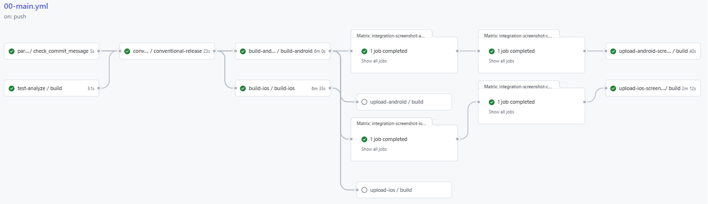

# Flutter Mobile App Pipelines

<p>
  <a href="https://github.com/microservicer/flutter-pipelines/actions/workflows/00-main.yml">
    
  </a>
  <a href="https://github.com/semantic-release/semantic-release">
    
  </a>
</p>

This repository contains the infrastructure code for deploying a Flutter mobile app to the Play Store and App Store.

It is an opinionated setup that is focused on using a native Flutter approach to building and deploying the app.
It is also focused on GitOps so that all changes are tracked within this repository.
The only exception is the Fastlane Match certificates and profiles that are stored in a separate repository,
depending on your setup.

If you like this repository, please give it a star! :star:

## Overview

The Flutter mobile app pipelines are a set of pipelines that are used to build and test the Flutter mobile app.
The pipelines are defined in the `.github/workflows/`directory in the root of this repository.
The pipelines are run on GitHub Actions.

[](./docs/images/main_full.png)

### How to trigger builds

The pipelines are triggered by the semantic-release git commits.
Please refer to the [semantic-release documentation](https://github.com/semantic-release/semantic-release#commit-message-format) for the conventions of the commit messages.

### Features

These are the features of the pipelines:
* **test** - run unit and integration tests
* **analyze** - run static code analysis
* **semantic versioning** - Create/append CHANGELOG.md and create a new version tag
* **build** - build the app for iOS and Android
* **screenshots** - take screenshots of the app and upload them to the Play Store and App Store
* **deliver** - deploy the app and metadata to the Play Store internal track and App Store TestFlight.

### Pipelines

In the `.github/workflows` directory you will find the pipelines used. The entrypoint is the `00-main.yml` file.
It is in this file that the other pipelines are called and the environment variables are set.
For basic usage, you only need to edit the `00-main.yml` file.

You can also set one branch (iOS or Android) to be built and deployed. in the `00-main.yml` file.
If you only want to build for one platform.

If you are using any other Match repository than Google Cloud. You will need to edit the `03a-build-ios.yml` file.

### Stages

The pipeline can run in 3 different modes:
* **test/analyze only** - only test and analyze the code, this happens on commits that are not deemed a new release
by semantic-release.
* **default** - build and test the app and upload changes to the Play Store and App Store.
this triggers on a new release by semantic-release.
* **screenshots** - build and test the app and upload screenshots to the Play Store and App Store.
this is triggered by a commit message containing a trigger word, default is "SCREENSHOT".
eg. `git commit -m "feat: add new screen -m "" -m "[SCREENSHOT]"`
The screenshot is an expensive operation and is therefore not run on every commit.

## Limitations

- Builds can be flaky due to problems with running emulators.
Tight timeouts has been added to the pipelines to reduce the risk of stuck jobs spending credits.
- Only checks last commit for screenshot keyword
- To be able to use the pipeline you have to build and upload the app bundle to the Play Store manually the first time.
- This project only focuses on App builds since there are too many differences on how people want to deploy to web.
If you are looking for an easy way with GitHub Actions to deploy to web, check out [Firebase](https://firebase.google.com/docs/hosting)

### Branch protection rules

If you have branch protection rules on your repository,
you will need to add a [personal access token](https://docs.github.com/en/authentication/keeping-your-account-and-data-secure/managing-your-personal-access-tokens) to the repository secrets.

You also need to give the account permission to bypass the branch protection rules.

- GH_TOKEN - A GitHub access token with either the `public_repo` or `repo` and `write:org` scope.

It is highly recommended that you use a machine account for generating the token.

## Prerequisites
The following prerequisites are needed to install and run the pipelines:

- [Flutter SDK](https://flutter.dev/docs/get-started/install)
- [Fastlane](https://docs.fastlane.tools/)
- [A GitHub repository](https://github.com/)
- [A Google Play Store account](https://play.google.com/console/u/0/developers) (for android builds)
- [An Apple Developer account](https://appstoreconnect.apple.com/) (for ios builds)

## Installing

The following steps are designed if you are going to use this project as boilerplate for a new Flutter app.
If you are interested in using this project as a template for an existing Flutter app,
you should be able to copy over the relevant files to your project and follow the appropriate steps below.
For Android make sure you also configure your app/build.gradle file with the correct signing [configs](#setup-android-manually).

### Clean up the repository

Run the following script to clean up the repository of files that need to be configured for your app:

```bash
./scripts/clean_up.sh
```

> This will rename this README.md file to README.md.old.

### Flutter
Get the latest dependencies by running the following command in the root of your Flutter project:

```bash
flutter pub get
```

### Renaming the package name
To rename the package name of your Flutter app, run the following command in the root of your Flutter project:
Change the `com.example.new_package_name` to the package name you want to use.
Change the `My New App Name` to the name you want to use for your app.

```bash
flutter pub global activate rename
flutter pub global run rename setBundleId -v com.example.new_package_name
flutter pub global run rename setAppName -v "My New App Name"
```
Make sure that all the files in the `android/app/src/main/kotlin/org/microservicer/bootstrap` 
directory are moved to the new package name directory and this is added to git.

### Git Hooks
You can use Git hooks to enforce commit message formatting to reduce the number of failed builds.
The hooks also make sure that the Flutter project is formatted correctly according to linting rules.
To install these hooks, run the following command after you clone the repository:

```bash
./scripts/install_hooks.sh
```

### Bundler
Make sure you have Ruby installed on your machine.

```bash
ruby -v
```
Install the bundler gem:

```bash
gem install bundler
```

## iOS
> iOS builds are very expensive to run since they required a Mac to run on.
> these are billed with 10x the price of a normal build. 

### Setup iOS
The following steps will help you run the iOS part of the pipeline.

Create a new App Store app in the [App Store Connect website](https://appstoreconnect.apple.com/).

#### API Keys
Generate a new App Store API key for the iOS app and store it in the GitHub repository secrets.

- At the [App Store Connect website](https://appstoreconnect.apple.com/access/api) and create a new API key.
- take a note of the Issuer ID and the Key ID. For later use.
- Then upload it to the GitHub repository secrets. Repository Settings > Secrets and variables > Actions > New repository secret.
- name: `APP_STORE_CONNECT_API_KEY` 

If you want to run locally you need to store the API key in a file called AuthKey.p8 in the `ios` directory.
Remember to add the file to the `.gitignore` file.

##### Fastfile

Make sure that you have set your API key ids in the top of the `ios/fastlane/Fastfile` file.

```ruby
...
# Change this to match your app's key and issuer
before_all do |lane, options|
app_store_connect_api_key(
  key_id: '4H27D3QLG2',
  issuer_id: 'ec2c19af-8deb-4579-be01-5d677995d709',
  key_filepath: './AuthKey.p8'
)
setup_ci if ENV['CI']
end
...
```

#### Fastlane
Make sure to update/create the `Appfile` file in the `ios/fastlane` directory.

- `Appfile`  - This file contains the app identifier and the Apple ID of the developer account.
It should have the following content:

```ruby
app_identifier("my.bundle.id") # The bundle identifier of your app
apple_id("machine@myorg.org") # Your Apple email address
itc_team_id("123456789") # App Store Connect Team ID
team_id("SAZY5AB444") # Developer Portal Team ID
```

#### Fastlane Match
The iOS app uses [fastlane match](https://docs.fastlane.tools/actions/match/) to manage the certificates and profiles.
To initialize the match repo, run the following command in the `ios` directory:

```bash
bundle exec fastlane match init
```
After following the steps make sure to store the secret(s) in the GitHub repository secrets.

If you have chosen to use Google Cloud Storage the secret is:
- `GC_KEYS` - The key to the Google Cloud Storage bucket.

To be accessed by the `03a-build-ios.yml` pipeline. Have you chosen another approach than Google Cloud Storage,
you will need to edit the `03a-build-ios.yml` file.
See the [Fastlane Match documentation](https://docs.fastlane.tools/actions/match/) for more information.

Then run the following command to create the certificates and profiles:

```bash
bundle exec fastlane register
```
Make sure that you have itc_team_id and team_id in the `Appfile` file in the `ios/fastlane` directory.

Then open Xcode and go to `target` > `Signing & Capabilities` and make sure that the Match certificates and profiles are selected.

##### Push certificates

If you need to enable push you should create a new push certificate using the pem command:

```bash
bundle exec fastlane pem
```

Then run the register lane:

```bash
bundle exec fastlane register
```

### Running iOS build locally

To run the iOS build locally you need to have a Mac with Xcode installed.

You also need to make sure that you have the API key stored in a file called `AuthKey.p8` in the `ios` directory.

You might also need the key to the repository that contains the Match certificates and profiles.

Then run the following command in the `ios` directory:

```bash
flutter build ios --release --no-codesign --config-only
bundle exec fastlane versioning
bundle exec fastlane build
```

## Android
Create a new app in the [Google Play Console](https://play.google.com/apps/publish/).

### API Keys
Create an API key for the Google Play Store.
You can use [this manual](https://docs.fastlane.tools/actions/upload_to_play_store/)

- Follow the steps in [this manual](https://docs.fastlane.tools/actions/upload_to_play_store/) to create a json key
- Then upload it to the GitHub repository secrets. Repository Settings > Secrets and variables > Actions > New repository secret.
- name: `PLAY_STORE_CONFIG_JSON` 

### Fastlane
Make sure to update/create the `Appfile` file in the `android/fastlane` directory.

It should have the following content:

```ruby
package_name("my.package.name")
```

### Metadata
Make sure to update the `metadata/android/` directory with the correct metadata for the app.

### Upload key
Generate a new upload key for the Android app and store it in the GitHub repository secrets.

- Follow the steps in the [Android documentation](https://developer.android.com/studio/publish/app-signing#generate-key)  to generate a new upload key.
    - Save the settings in the `android/key.properties`  file.
        - `storePassword` 
        - `keyPassword` 
        - `keyAlias` 
        - `storeFile` 
- Base64 encode the `android/app/upload-keystore.jks`  file.
    - `base64 android/app/upload-keystore.jks`
- Then upload it to the GitHub repository secrets. Repository Settings > Secrets and variables > Actions > New repository secret.
- name: `PLAY_STORE_UPLOAD_KEY` 
- Add each of the other line from the `key.properties`  as separate secrets:
    - `KEYSTORE_KEY_ALIAS` 
    - `KEYSTORE_KEY_PASSWORD` 
    - `KEYSTORE_STORE_PASSWORD` 

> Make sure the `key.properties` and the generated key is in the `.gitignore` file.

### Build Android locally

#### First time
To be able to use the pipeline you have to build and upload the app bundle to the Play Store manually the first time.

You need to build the app bundle manually the first time with the following command:
```bash
flutter build appbundle
```
This is because the pipeline is dependent on the app bundle name that can only be set when uploading the app bundle to the Play Store.

##### Generate signing key
[Google Play Console](https://play.google.com/apps/publish/). > Your app > Testing > Internal Testing and "Choose signing key"
and select "Use Google-generated key".

#### After first time
Make sure you have the following:

- `key.properties`  in your `android`  directory.
- your upload key in the `android/app`  directory.
- the API key stored in the `PLAY_STORE_CONFIG_JSON`  env or in a file called `key.json`  in the `android`  directory.
- Export your flutter project path `export FLUTTER=$FLUTTER_PATH`  where `$FLUTTER_PATH`  is the path to your flutter installation.

Then run the following command in the `android` directory:

```bash
bundle exec fastlane versioning
bundle exec fastlane build
```

#### Upload manually

Then upload the app bundle to the Play Store.

- Create release > Upload your app bundle. 
- You can find the app bundle in the `build/app/outputs/bundle/release/app-release.aab`  directory.

## Setup Android Manually
The following steps will help you run the `03b-build-android.yml` pipeline if you only copied the files from this repository.

You will need to replace the following classes in your build.gradle file:

```groovy
def keystoreProperties = new Properties()
def keystorePropertiesFile = rootProject.file('key.properties')
if (keystorePropertiesFile.exists()) {
    keystoreProperties.load(new FileInputStream(keystorePropertiesFile))
}

android {
    ...
    signingConfigs {
        release {
            keyAlias keystoreProperties['keyAlias']
            keyPassword keystoreProperties['keyPassword']
            storeFile keystoreProperties['storeFile'] ? file(keystoreProperties['storeFile']) : null
            storePassword keystoreProperties['storePassword']
        }
    }
    buildTypes {
        release {
            signingConfig signingConfigs.release
        }
    }
    ...
}
```

## Common errors:

- `"Failed to read key  from store "../android/app/upload-keystore.jks": Tag number over 30 is not supported"` 
  This means that you missed to upload the keystore to GitHub secrets. Remember to base64 encode it first!

- `"This job failed"` on the `02-conventional-release.yml` job.
  This means that you missed creating a `GH_TOKEN` secret in the repository secrets.

## Take screenshots locally

To take screenshots locally you can run the following commands to build and run the driver:

```bash
flutter drive --driver=test_driver/screenshot_test.dart --target=integration_test/screenshot_test.dart
```

Make sure that you have a simulator running before you run the command.

## Resources
- [Guide](https://keyholesoftware.com/2023/02/13/automating-flutter-deployments-part-2-screenshots/)  on how to set up screenshots for the App Store and Play Store
- [Flutter Integration Test](https://flutter.dev/docs/cookbook/testing/integration/introduction) 
- [Flutter Integration Test Repo](https://github.com/flutter/flutter/blob/master/packages/integration_test/README.md) 
- [emulator](https://pub.dev/packages/emulators) 
- [iOS screenshot sizes](https://appradar.com/blog/ios-app-screenshot-sizes-and-guidelines-for-the-apple-app-store) 
- [iOS emulator Action](https://github.com/marketplace/actions/launch-ios-simulator) 
- [Android emulator Action](https://github.com/marketplace/actions/android-emulator-runner) 
- [PR linter](https://github.com/amannn/action-semantic-pull-request) 

